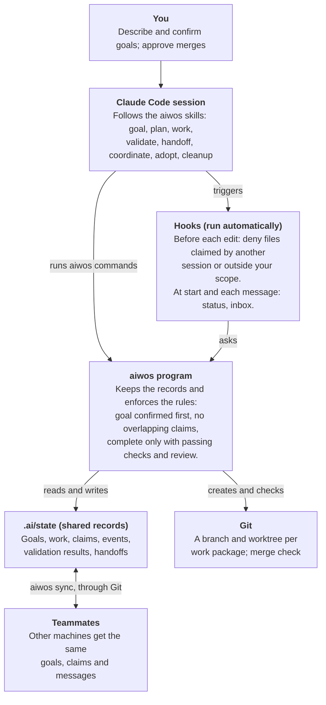
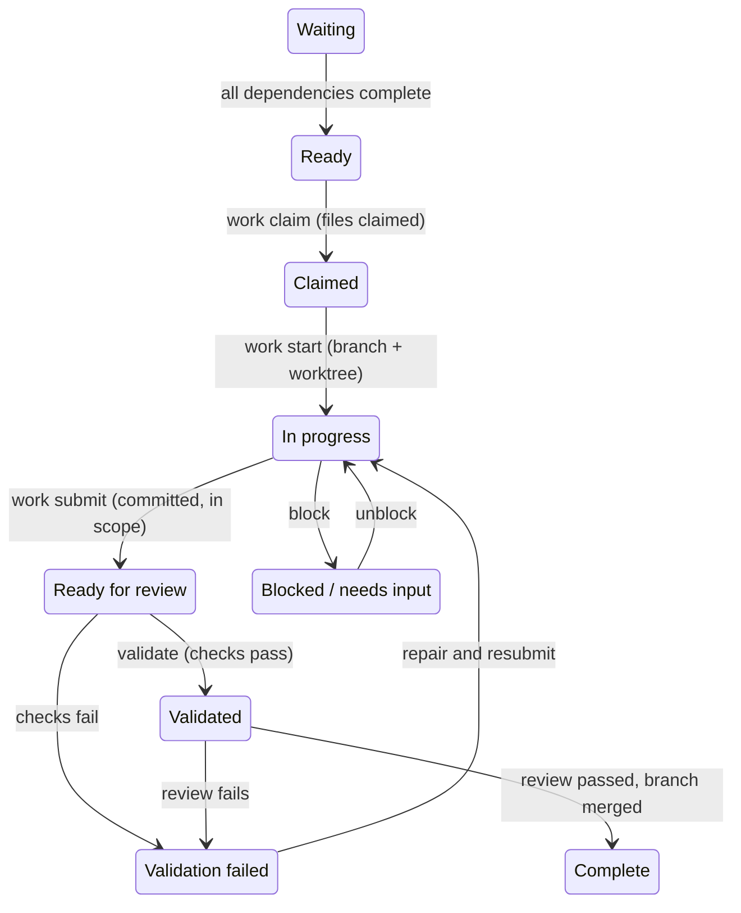

# AI Work OS — User Manual

Version 0.1 · 2026-10-05

AI Work OS turns Claude Code from a single conversation into a coordinated team: you state a goal, confirm it, and Claude plans, claims, builds and validates the work across one or many sessions — and cannot call anything done without evidence.

## At a glance



Skills tell Claude how to work. Anything that must hold regardless — confirmation before work, one owner per file, completion only with evidence — is checked by the `aiwos` program, which the hooks call on every edit and message.

## Requirements

You need Claude Code, Python 3.9 or newer, and Git. Nothing else is installed: the framework uses only Python's standard library.

| Item | Needed for | Notes |
| --- | --- | --- |
| Claude Code | everything | skills, subagents and hooks are standard Claude Code features |
| Python 3.9+ | the `aiwos` program | found automatically as `python3`, `python` or `py`; set `AIWOS_PYTHON` to force one |
| Git, with at least one commit | branches, worktrees, multi-machine sync | without Git, goals, plans, claims and validation still work, but there are no per-task branches |
| Git Bash (Windows only) | hooks | Claude Code runs hooks through Git Bash on Windows; it ships with Git for Windows |
| GitHub CLI `gh` | optional: opening pull requests | not required by the framework itself |

## Install

One command installs AI Work OS into a project; restart Claude Code afterwards so the hooks load. The installer never overwrites your own files: it merges, appends between markers, and backs up anything it touches to `.ai/backups/`.

**New or existing project**

1. Commit or stash your current changes, so the install is easy to review and undo.
2. Preview what will change: `python3 <work-os>/framework/aiwos_main.py init <your-project> --dry-run`
3. Install: `python3 <work-os>/framework/aiwos_main.py init <your-project>`
4. Commit the new `.ai/`, `.claude/` and `CLAUDE.md` changes. Teammates and worktrees get the framework from Git.
5. Restart Claude Code in the project. The first message of each session now starts with a short AI Work OS status line.

If the project already has agents, skills, hooks or long instruction files, continue with “Adopting an existing AI project” below before changing anything.

**Optional: install once, use everywhere**

Add `--user-skill` to the install command once. It adds a personal `/aiwos-init` command to Claude Code, so in any future project you just type `/aiwos-init` and Claude inspects the project, previews and installs.

**What gets added**

| Path | What it is | Commit it? |
| --- | --- | --- |
| `.ai/runtime/`, `.ai/bin/aiwos`, `.ai/bin/aiwos.cmd` | the `aiwos` program and its launchers (sh / Git Bash, cmd / PowerShell) | yes |
| `.ai/config.json` | your settings | yes |
| `.ai/manifest.json` | which framework files were installed, for safe upgrades | yes |
| `.ai/state/` | shared working records: goals, work, sessions, claims, events | no (git-ignored; shared with `aiwos sync`) |
| `.claude/skills/aiwos-*` | the 8 lifecycle commands | yes |
| `.claude/agents/aiwos-*` | reviewer, researcher and worker subagents | yes |
| `.claude/settings.json` | 5 hooks merged in, plus permission to run `.ai/bin/aiwos`; your settings are kept | yes |
| `CLAUDE.md` | about 30 lines of rules between `<!-- aiwos:begin -->` and `<!-- aiwos:end -->`; your text is kept | yes |

## Quick start: your first goal

You talk to Claude as usual; the framework decides the order of work and keeps the records. A first goal takes five steps, and you are asked to act only at step 1 and step 5.

1. **Describe the goal.** Type what you want, or `/aiwos-goal I want a pricing page with monthly and yearly plans`. Claude asks only the questions that change the result, usually as A/B/C choices, and lists anything it assumed. It shows you the outcome, success criteria, scope and assumptions. **Confirm or correct it.** Nothing is built before you confirm.
2. **Plan.** Claude runs `/aiwos-plan GOAL-001`: it splits the goal into work packages, each with the files it may change, what it depends on, and the commands that prove it works. Overlaps between packages that could run at the same time are flagged and fixed before any work starts.
3. **Work.** Claude runs `/aiwos-work`: it takes the next ready package, claims it, creates a branch and a separate working folder (a Git worktree), reads a short context summary, makes the changes and commits them.
4. **Validate.** Claude runs `/aiwos-validate WP-001`: the `aiwos` program runs the package's checks itself and records the real result. Medium- and high-risk work also goes to an independent reviewer agent. Failures are repaired and re-checked.
5. **Integrate.** Claude asks before merging into your main branch or pushing (both are visible to others). After the merge, `aiwos work complete` closes the package, and packages that were waiting on it become ready.

Repeat steps 3–5 until every package is complete; then Claude completes the goal with evidence for each success criterion and offers a cleanup audit (`/aiwos-cleanup`).

At any point, `aiwos status` shows where everything stands:

```
GOAL-001 [ACTIVE] Pricing page
  WP-001  COMPLETE          Plans API contract
  WP-002  IN_PROGRESS       Pricing UI owner=S-4f2a91c0
  WP-003  WAITING           Checkout tests waits:WP-002
sessions: 1 live
claims: S-4f2a91c0 WRITE workspace/frontend/pricing/**
```

Small, clear requests (“rename this variable”, “explain this file”) skip all of this: Claude just does them.

## Core concepts

Nine terms cover everything the framework does. The rules in the last column are enforced by the `aiwos` program, not left to Claude's memory.

| Term | What it is | Rule that is enforced |
| --- | --- | --- |
| Goal | what you want to achieve: outcome, success criteria, scope, non-goals, assumptions | no work starts until you confirm it; changing what success means sends it back for re-confirmation |
| Work package (WP) | one bounded piece of the goal, with allowed files, dependencies and checks | a package can start only when the packages it depends on are complete |
| Session | one Claude Code window, registered automatically (`S-xxxxxxxx`) | every action is recorded with the session that did it |
| Claim | a session's hold on a package or on files: READ, WRITE or EXCLUSIVE | two sessions cannot WRITE the same file; edits to someone else's files are blocked before they happen |
| Lease | a session's “I'm alive” timestamp, renewed on every message and edit | after 30 minutes of silence its claims lapse and its work can be taken over |
| Contract | a shared spec file (API, schema, component props) two packages build against | editing it alerts every package that uses it |
| Decision | a record in `knowledge/decisions/D-NNN-*.md` with options, choice and reason | old decisions are superseded, never silently rewritten |
| Validation | the package's checks, run by the program, with real exit codes stored | “no checks” counts as incomplete, never as a pass |
| Completion gate | the list of conditions for calling a package complete | submitted, checks passing since the last change, independent review passed (medium and high risk), branch merged |

Every change is also written to an append-only event log, so `aiwos trace <file>` can answer “why does this file exist, and was it validated?”

## The lifecycle



Failed checks or reviews always loop back to In progress for repair; a new submission clears old results, so every completion rests on checks run after the last change. If the owning session stops for 30 minutes or hands the work off, the package returns to Ready and keeps its branch.

## Several sessions on one machine

Open as many Claude Code windows in the project as you like; each one picks different work and they cannot overwrite each other. All sessions on a machine share the same records in `.ai/state/`, including sessions running inside worktrees.

- **Splitting work:** in each window, run `/aiwos-work` (or ask “what can I work on?”). `aiwos next` only offers packages that are ready, unowned and free of conflicting claims.
- **Separate folders:** each package gets its own branch and worktree under `.ai/worktrees/WP-NNN`, so files on disk never collide. Claude works inside that folder.
- **Blocked edits:** if a session tries to edit a file another session claimed, the edit is denied with the owner's session id and three ways forward: take other work, ask for a release (`aiwos send S-xxxx REQUEST_RELEASE --work WP-NNN`), or agree a contract.
- **Messages between sessions:** completed dependencies, contract changes and direct requests appear at the start of the receiving session's next turn. `aiwos inbox` lists them; `aiwos inbox --ack` marks them read.
- **Stopping halfway:** `/aiwos-handoff WP-NNN` writes a short handoff (done, remaining, problems, next step) and returns the package to the pool. Any session continues it with `/aiwos-work WP-NNN`.
- **A window crashed or was closed:** its claims lapse after 30 minutes. Its work shows in `aiwos next` as `[RECOVER]` and continues on the same branch; `aiwos recover` frees it immediately.

## Working as a team across machines

Teammates share the same goals, claims and messages through Git: `aiwos sync` exchanges them on a separate branch, `aiwos-state`, which never touches your code. Code itself still flows through normal branches and pull requests.

**One-time setup (one person)**

1. Install AI Work OS and commit it, as in Install.
2. In `.ai/config.json`, set `"sync": {"remote": "origin"}` and commit.
3. Push. Each teammate pulls; no separate install is needed.

**Daily rhythm (everyone)**

| When | Run | Why |
| --- | --- | --- |
| Start of a session | `aiwos sync` | see the latest goals, claims and messages |
| After claiming work | `aiwos sync` | others see your claim before they pick the same work |
| After completing or handing off | `aiwos sync` | dependants become ready for others |
| Every hour or so while working | `aiwos sync` | keep claims and messages fresh |

You can simply ask Claude to sync; `/aiwos-coordinate` covers the details. The first push of `aiwos-state` is visible to the whole team, so Claude asks before doing it.

**What happens when two people collide**

- Both pick the same package: the second claim is refused once the first is synced.
- Both claimed overlapping files while out of sync: on the next sync every machine flags the conflict, the earlier claim wins, and the later session's edits to those files are blocked until it releases them.
- Both created a goal with the same number: both are kept, and a blocking conflict is reported for a person to resolve.

## Adopting an existing AI project

If your project already has agents, skills, commands, hooks or instruction files, AI Work OS analyzes them first and changes nothing until you approve a migration plan. Installing alone is already safe: your files are kept and framework files use the `aiwos-` prefix.

1. **Install and restart**, as in Install.
2. **Run `/aiwos-adopt`.** Claude runs `aiwos adopt scan`, a read-only inventory written to `workspace/migration/`:
   - `project-model.md`: every agent, skill, command, rule, hook, MCP server and instruction file;
   - problems found: broken hook scripts and imports, duplicate or near-duplicate agents and skills, instructions that contradict each other (“always X” in one file, “never X” in another);
   - `capability-map.json`: one row per existing capability, all marked UNKNOWN to start.
3. **Review the map.** Claude fills in what each capability does and what must not change, and proposes a status for each: PRESERVED, IMPROVED, REPLACED, DEPRECATED or REMOVED.
4. **Approve a migration level.** Analyze (no changes) → Normalize (tidy the structure, same behavior) → Optimize (improve behavior) → Modernize (everything runs through goals and work packages). Each level beyond Analyze becomes a normal goal you confirm.
5. **Migrate in small steps.** Each step is a work package with its own validation; old implementations stay until their replacement is validated.
6. **Verify.** `aiwos adopt verify` passes only when no capability is UNKNOWN or PARTIAL, every referenced implementation exists, and every replacement has validation evidence.

## Command reference

You mostly use the eight slash commands, or just describe what you want; Claude runs the `aiwos` commands for you. Run `aiwos` yourself when you want to look or decide directly.

**Slash commands (in Claude Code)**

| Command | Use it to |
| --- | --- |
| `/aiwos-goal <what you want>` | turn an idea into a goal you confirm |
| `/aiwos-plan GOAL-001` | split a confirmed goal into work packages, or replan |
| `/aiwos-work [WP-001]` | pick up the next ready package (or a given one) and build it |
| `/aiwos-validate WP-001` | check, review, repair, merge and complete a package; with a goal id, complete the goal |
| `/aiwos-handoff WP-001` | stop mid-work and pass it on with a short handoff |
| `/aiwos-coordinate` | see who does what, resolve conflicts, recover crashed sessions, sync with teammates |
| `/aiwos-adopt [level]` | bring an existing AI project in safely |
| `/aiwos-cleanup` | audit the workspace after a milestone |
| `/aiwos-init` | install into the current project (only if you installed the personal command) |

**The `aiwos` program**

Inside Claude Code it is on the path as `aiwos`. In your own terminal use `sh .ai/bin/aiwos` (macOS, Linux, Git Bash) or `.ai\bin\aiwos.cmd` (cmd, PowerShell). Add `--json` to any command for machine-readable output.

| Command | What it does |
| --- | --- |
| `aiwos status` | goals, packages, live sessions, claims, conflicts |
| `aiwos next` | packages you can safely take now |
| `aiwos context WP-001` | the short context summary for one package |
| `aiwos inbox [--ack]` | messages for your session; `--ack` marks them read |
| `aiwos goal new\|show\|list\|update\|confirm\|complete\|abandon` | manage goals; `confirm --by <name>` records your approval |
| `aiwos work add\|list\|graph\|show\|claim\|start\|submit\|complete\|gate\|block\|unblock\|release\|fail` | manage work packages; `gate` lists what still blocks completion |
| `aiwos validate WP-001` | run the package's checks and record the result |
| `aiwos review WP-001 --verdict pass\|fail --reviewer <name>` | record an independent review |
| `aiwos handoff WP-001 --completed … --remaining … --next …` | write a handoff and release the package |
| `aiwos claim add\|release\|list\|check` | inspect or change file claims by hand |
| `aiwos send S-xxxx REQUEST_RELEASE --work WP-001` | ask another session for something (also ASSIGN_WORK, REQUEST_REVIEW, REQUEST_INPUT, REQUEST_CHANGE) |
| `aiwos recover` | free work held by sessions that stopped |
| `aiwos sync` | exchange records with teammates through Git |
| `aiwos decision new\|accept\|reject\|supersede` | manage decision records in `knowledge/decisions/` |
| `aiwos contract add\|list\|check` | register shared spec files; `check` alerts users of changed ones |
| `aiwos route WP-001` | recommended model tier for the package |
| `aiwos trace <file>` | why a file exists: which package and goal, and whether it was validated |
| `aiwos doctor` / `audit` / `metrics` | consistency check / clutter audit / counts of conflicts, failures, handoffs |
| `aiwos adopt scan\|verify` | inventory an existing AI project / check the migration is complete |
| `aiwos init` / `uninstall` | install, upgrade or remove the framework |

Exit codes: `0` success, `1` a check or audit found problems, `2` the command was refused (the reason is printed), `3` claim conflict.

## Configuration

All settings live in `.ai/config.json`; anything you leave out uses the default below. Commit the file so the whole team shares one policy.

| Setting | Default | What it controls |
| --- | --- | --- |
| `lease_ttl_seconds` | `1800` (30 min) | how long a silent session keeps its claims |
| `enforcement.out_of_scope_writes` | `"deny"` | `deny` blocks edits outside your own claimed files; `warn` allows them with a notice |
| `enforcement.protected` | `.ai/state/**`, `.ai/runtime/**`, `.ai/bin/**` | paths only the `aiwos` program may change |
| `git.branch_prefix` | `"ai/"` | prefix of per-package branches |
| `git.use_worktrees` | `true` | give each package its own working folder |
| `git.worktree_dir` | `".ai/worktrees"` | where those folders go |
| `git.base_branch` | current branch | branch packages start from and merge into |
| `git.require_merge` | `true` | a package is complete only after its branch is merged |
| `sync.remote` | `null` | Git remote used by `aiwos sync`, e.g. `"origin"`; `null` = this machine only |
| `sync.branch` | `"aiwos-state"` | remote branch that carries the shared records |
| `validation.review_required_for_risk` | `["medium", "high"]` | which risk levels need an independent review |
| `validation.timeout_seconds` | `1800` | time limit per check command |
| `validation.output_tail_chars` | `3000` | how much check output is kept for diagnosis |
| `context.inbox_min_priority` | `"IMPORTANT"` | lowest priority shown in a session's inbox |
| `routing.tiers`, `routing.rules`, `routing.default_tier` | light = haiku, standard = sonnet, deep and review = opus | which model `aiwos route` recommends for a package's risk and complexity |
| `cleanup.allowed_root_entries` | none | extra top-level files and folders the cleanup audit should accept |

Example: a team that wants warnings instead of blocks, 15-minute leases and shared records:

```json
{
  "version": 1,
  "lease_ttl_seconds": 900,
  "enforcement": {"out_of_scope_writes": "warn"},
  "sync": {"remote": "origin"}
}
```

Per-person settings go in `.ai/local.json` (not committed): `python` (which interpreter to use) and `actor` (your display name; defaults to your Git user name).

## Where things live

The project root stays clean: work goes in `workspace/`, lasting knowledge in `knowledge/`, and the framework's own records in `.ai/`. Folders are created only when a goal needs them.

| Path | Holds | Format |
| --- | --- | --- |
| `workspace/<area>/` | the work itself: code, specs, designs, research (e.g. `workspace/backend/`, `workspace/specs/`, `workspace/research/`) | anything |
| `workspace/migration/` | adoption inventory and capability map | Markdown, JSON |
| `knowledge/` | knowledge worth keeping beyond one goal | Markdown |
| `knowledge/decisions/D-NNN-*.md` | decision records, each with a `Status:` line | Markdown |
| `.ai/state/goals/GOAL-NNN/` | the goal and its work package definitions | JSON |
| `.ai/state/events/` | the append-only log of everything that happened, one file per session | JSON lines |
| `.ai/state/sessions/`, `claims/` | who is active and what they hold | JSON |
| `.ai/state/validation/` | every check and review result, with output | JSON |
| `.ai/state/handoffs/` | handoffs between sessions | Markdown |
| `.ai/worktrees/WP-NNN/` | per-package working folders (Git worktrees) | your project files |

Do not edit `.ai/state/` by hand; the hooks block it and the `aiwos` commands keep it consistent. `aiwos doctor` checks it.

## Troubleshooting

Most problems are explained by the refusal message itself; `aiwos status` and `aiwos doctor` cover the rest.

| Symptom | Likely cause | Fix |
| --- | --- | --- |
| No “AI Work OS: session …” line at session start | hooks not loaded | restart Claude Code in the project root; check `.claude/settings.json` contains the `aiwos` hooks |
| `aiwos: command not found` in Claude's shell | the session started before the install | restart the session, or use `sh .ai/bin/aiwos` |
| `Python 3.9+ not found` | no suitable interpreter on PATH | install Python 3.9+, or set `AIWOS_PYTHON` / the `python` key in `.ai/local.json` |
| “GOAL-001 is PROPOSED; confirm it…” | work was requested before you approved the goal | review the goal and confirm it, or tell Claude what to change |
| An edit is denied: “claimed by session S-…” | another session holds that file | let Claude take other work, send a release request, or agree a contract (`/aiwos-coordinate`) |
| An edit is denied: “outside this session's claimed scope” | the package's file list is too narrow, or the edit doesn't belong to this package | widen the package (`aiwos work update`) or `aiwos claim add '<path>'` if intended; or set `out_of_scope_writes` to `warn` |
| “cannot complete WP-…” with a list | the completion gate is not met | do what each line says; `aiwos work gate WP-…` shows the current list |
| Validation says INCOMPLETE | the package has no runnable checks | add real check commands to the package |
| “repository has no commits yet” | branches need a first commit | make an initial commit |
| Work held by a closed window | its lease has not expired yet | `aiwos recover` after 30 minutes, or wait; the work keeps its branch |
| Teammate doesn't see your claim | records not exchanged | both run `aiwos sync`; check `sync.remote` is set |
| Something hook-related misbehaves silently | a hook error (hooks never block your session on their own failure) | read `.ai/state/.local/hook-errors.log` |

## Upgrade and uninstall

Upgrading is the install command again; uninstalling removes the framework but keeps your goals, decisions and work.

- **Upgrade:** `python3 <work-os>/framework/aiwos_main.py init <your-project>`. The program is replaced; skills and agents you edited yourself are kept and listed as `KEEP`. Add `--force` to replace them anyway. Commit the result.
- **Uninstall:** `sh .ai/bin/aiwos uninstall` from the project. It removes unmodified framework files, the `aiwos` hooks and permissions, and the `CLAUDE.md` block. It keeps `.ai/config.json`, `.ai/state/`, `knowledge/`, `workspace/`, your own hooks and settings, and any framework file you modified.
- **Restore a file:** every file the installer changed is copied first to `.ai/backups/<timestamp>/`.

## Limitations and FAQ

Version 0.1 enforces file ownership for Claude's edit tools, not for every shell command, and has been tested on Windows only.

**Known limitations**

- Files written through shell commands (`echo > file`, `sed -i`) are not blocked when written; they are caught when the package is submitted.
- Subagents inside one Claude Code window share that window's claims; for strict separation, run separate windows.
- Reviewer independence comes from a fresh-context reviewer agent and a recorded reviewer name, not from separate credentials.
- Teammates see each other's records as of their last `aiwos sync`.
- Opening pull requests is done by Claude with `gh` when available; the `aiwos` program does not wrap it yet.
- Tested with 52 automated tests on Windows; live sessions on macOS and Linux are not yet verified.

**FAQ**

- **Does it slow Claude down?** Each hook call takes a fraction of a second. Small requests skip the goal process entirely.
- **Does it use more tokens?** Usually fewer: sessions get a short summary and file paths instead of the whole project, and skills load only when used.
- **Can I use it without Git?** Yes, for goals, plans, claims, validation and handoffs. Branches, worktrees, merge checks and team sync need Git.
- **Can a person take a work package?** Yes. Start a session with `aiwos session start --human`, then claim and work through the same commands.
- **Can Claude approve the goal for me?** No. Confirmation is recorded with the approver's name, and the instructions require your actual answer.
- **Which model does it use?** Your session's model. For subagents, `aiwos route` recommends a tier per package (configurable in Configuration).
